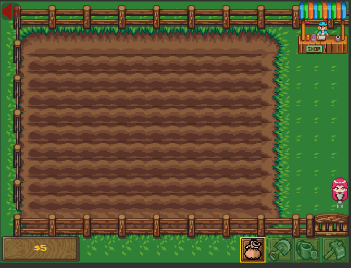
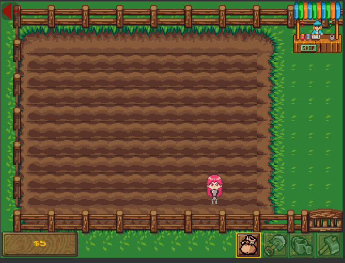
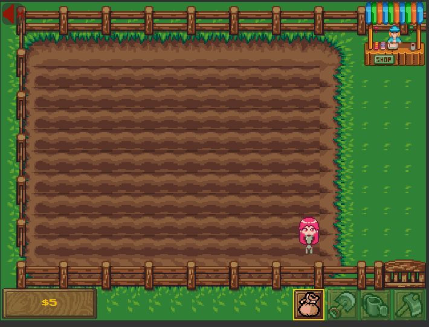
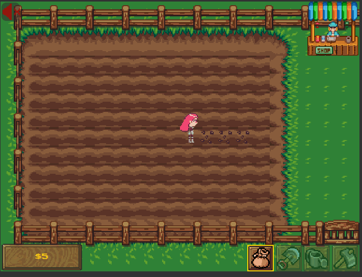
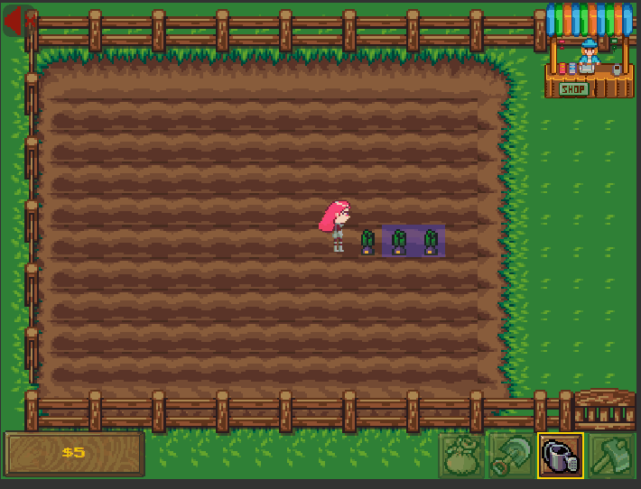
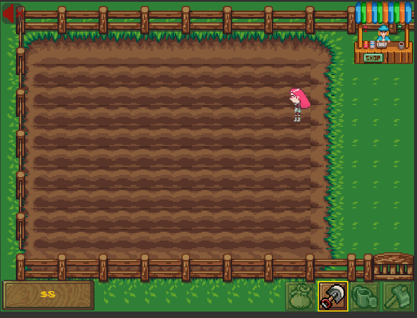
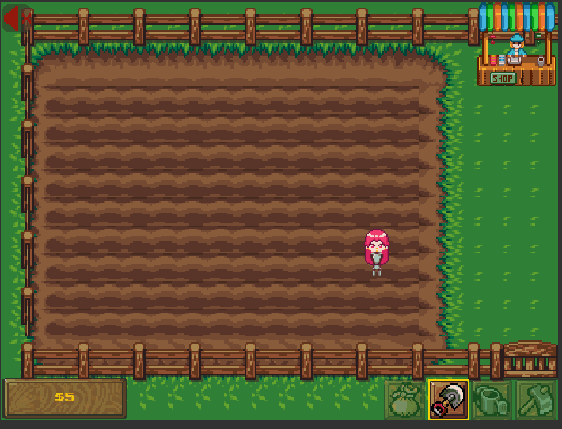

# Farming Sim

A vanilla JS web application to simulate farming, built in 48 hours for the [Mintbean](https://www.mintbean.io/) No Mouse Hackathon.

## Technologies Used
- Vanilla JavaScript
- Webpack
- Babel


## How to Play

The Farming Sim application does not use the mouse.  Only uses the keyboard.

### Basics

- WASD - Move your character around
- M - Unmute/Mute sound effects
- I - Inventory
- ESC - Exit modals
- SPACE - Use your tools or interact with the shop



### Farming

With the correct tool selected you can farm on the brown pieces of land.
- Space - Use tool
- Left Arrow/Right Arrow - Navigate through your tool system



### Farming - Planting

With the seed bag selected you can select a seed to plant.
- SPACE - **Attempt** to plant a seed
- A/D - Navigate between which seeds to plant in your inventory



### Farming - Watering

Your plants can only grow if they are watered, to water a plant use the watering can. Some plants take longer to grow than others. Every time your plant grows you need to water it again.



### Farming - Harvesting

Once you can't water the plant anymore, use the shovel to harvest the crop.



### Farming - Hoeing

To remove a seed/crop use the hoe. Be careful because this will destroy it.



### Shopping

Once you have crops you can sell them. You can use the money to purchase different types of seeds.

- Tab - Switch between selling and buying
- A/D - Move through items
- Esc - Close shop screen
- Space - Purchase/Sell Item



## Development

1. Clone the repository

  ```bash
    git clone https://github.com/shadorki/farming-sim-no-mouse-hackathon.git
  ```
2. Change directories

  ```bash
    cd farming-sim-no-mouse-hackathon
  ```

3. Install Dependencies

  ```bash
    npm install
  ```

4. Run Development Server

  ```bash
    npm run dev
  ```

## Final Thoughts

Its currently 2AM on a Thursday night.  I haven't left my chair in a long time and all I have thought about for the past couple days was this game.  The logic is simple and yet so complex.  There is a single game loop that ages all the crops every second.  Each crop has a set growth cycle, which decides at what point in time will it age.  I was inspired by Stardew Valley and this hackathon seemed to fit the perfect need for a clone.  Special thanks to Mintbean for hosting, Tim D and Cody for getting my slack messages late at night, and Kevin (Bep) Lenell for cheering me on.

Many of the assets in the game were taken from sites like OpenGameArt and SpritesResource.  I will add the credentials to the creators of the assets.

Thanks for reading and playing!

## Credits

  - [Main Character Sprites](https://arcadeisland.itch.io/top-down-rpg-characters)
  - [Crop Sprites](https://opengameart.org/content/farming-crops-16x16)
  - [UI Blocks and Map Tile Set](https://opengameart.org/content/lpc-farming-tilesets-magic-animations-and-ui-elements)
  - [Shop Stall from Stardew Valley](https://www.spriters-resource.com/pc_computer/stardewvalley/sheet/88590/)
  - [Tools](https://jordizzle.itch.io/farming-game-asset-pack-1)
